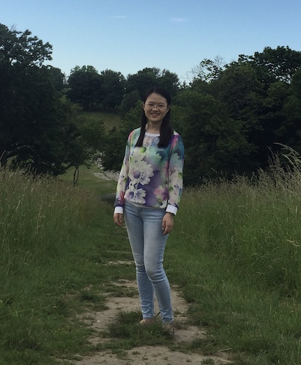

I have a math PhD from [Northeastern University](https://cos.northeastern.edu/mathematics-3/), supervised by [Prof. Losev](https://gauss.math.yale.edu/~il282/index.html). My research interest was Representation theory and Algebraic Geometry. I graduated in July 2018, with the thesis *Representations of Cyclotomic Rational Cherednik Algebras with Aspherical Parameters* ([preprint](https://arxiv.org/abs/1809.06724) on arXiv).

During the last year in my PhD, I started learning data science and machine learning through online resources. After joining Fidelity AI CoE, since the company has enterprise accounts on several platforms including Coursera, Udemy and LinkedIn Learning, I have been learning a lot of skills on __deep learning and software development__, and working on side projects to practice those skills. The progress, although slow, is recorded [here](/projects.html/).

At Fidelity, I mainly work on NLP algorithms to support financial advisors and customer service groups to better understand our customers. Meanwhile, I am also exposed to projects leveraging regression, computer vision, and reinforcement learning.  

Last but not least, I'm the Mom of an adorable baby, [Robin](/robin.jpg/). 
<!-- ### Footer
Last updated: Nov 2019 -->

